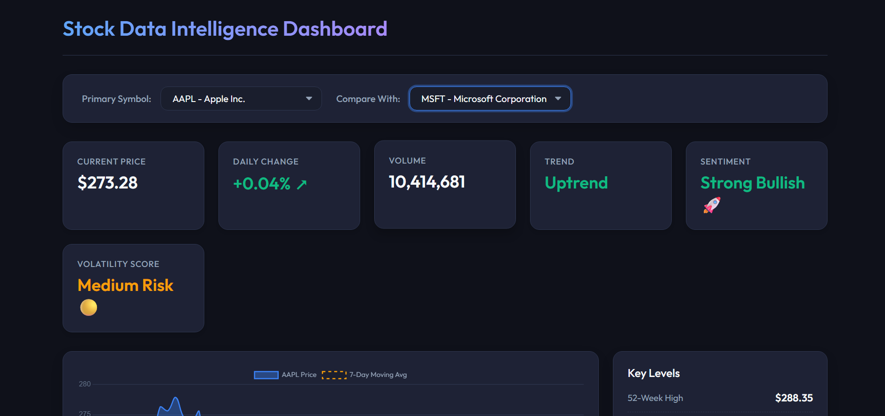

# 📊 Stock Data Intelligence Dashboard

## 🚀 Overview

The **Stock Data Intelligence Dashboard** is a full-stack web application that allows users to fetch, analyze, and visualize stock market data in an interactive and user-friendly way.

It combines a powerful Python backend with a modern React frontend to provide meaningful insights into stock performance, trends, and key financial metrics.

---

## 🎯 Features

* 📡 **Real-time Stock Data**

  * Fetches live stock data using yfinance

* 📈 **Interactive Charts**

  * Visualizes stock price trends using Chart.js
  * Includes moving average overlay

* 📊 **Technical Indicators**

  * Daily Returns
  * 7-day Moving Average
  * Volatility (standard deviation)

* 📌 **Key Metrics Dashboard**

  * Current Price
  * Daily Change (%)
  * Volume
  * Trend indicator

* 🔍 **Stock Comparison (Optional)**

  * Compare performance of two stocks

* 🧠 **Smart Insights**

  * Identifies trend (Uptrend / Downtrend)
  * Highlights basic market conditions

---

## 🧱 Project Structure

```bash
stock-dashboard/
│
├── backend/
│   ├── app/
│   │   ├── main.py
│   │   ├── routes/
│   │   ├── services/
│   │   └── utils/
│   ├── requirements.txt
│
├── frontend/
│   ├── src/
│   │   ├── components/
│   │   ├── pages/
│   │   ├── services/
│   │   └── App.jsx
│   ├── package.json
│
└── README.md
```

---

## ⚙️ Tech Stack

### Backend

* Python
* FastAPI
* Pandas
* yfinance

### Frontend

* React
* Chart.js

---

## 🔌 API Endpoints

| Endpoint            | Description                    |
| ------------------- | ------------------------------ |
| `/companies`        | List available stock symbols   |
| `/data/{symbol}`    | Get last 30 days of stock data |
| `/summary/{symbol}` | Get high, low, average price   |
| `/compare`          | Compare two stocks (optional)  |

---

## ▶️ How to Run the Project

### 🔧 Backend Setup

```bash
cd backend
python -m venv venv
venv\Scripts\activate      # Windows
# source venv/bin/activate  # Mac/Linux

pip install -r requirements.txt
uvicorn app.main:app --reload
```

👉 Backend runs at:
http://127.0.0.1:8000

---

### ⚛️ Frontend Setup

```bash
cd frontend
npm install
npm run dev
```

👉 Frontend runs at:
http://localhost:5173

---

## 📸 Dashboard Preview

(Add a screenshot of your dashboard here)

```md

```

---

## 🧠 Insights Logic

The dashboard generates simple insights based on:

* Price vs Moving Average → Trend detection
* Volatility → Risk indication
* Daily change → Market movement

---

## 🎯 Objective

This project demonstrates:

* Backend API development using FastAPI
* Data processing and transformation using Pandas
* Frontend development with React
* Data visualization using Chart.js
* Clean project architecture and modular design

---

## ⚠️ Limitations

* Uses historical data (not real-time streaming)
* ML prediction (if added) is basic and not production-grade

---

## 🚀 Future Improvements

* Add real-time streaming data
* Integrate machine learning prediction
* Add dark mode UI
* Deploy using Docker / Cloud

---

## 👩‍💻 Author

**Aamna Rifa**

---

## 📌 Note

This project is built for educational and internship assignment purposes.
